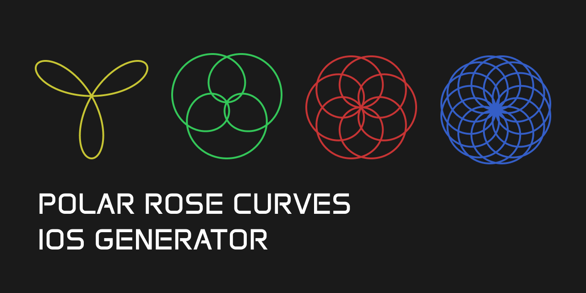

  

# Polar Rose Curves

**Polar Rose Curves** is a Swift iOS App designed to display animations that draw the different curves in the Polar Rose family, a collection of drawings defined by a modular mathematical equation.

## Features

- **Sliders** to control the value of the two **parameters of the Polar Rose Curve equation**.
- **Animation** of the curve described by the set parameters.

## Screenshots

  
  
  
  

## Future Features

- Add Settings for:
  - Colors
  - Speed
  - Max/Min  

At the moment, there are no plans to introduce any new features.

## Issues

- The launch screen doesn't display the right background color
- I might be using the function that calculates the constant drawing velocity wrong because, after it's done drawing, the white dot speeds up.

## Requirements

Before you begin, ensure you have:

- **Xcode**: Required to compile the project.
- **iPhone** device to run the App.

## License

This project is licensed under the MIT License.

#

**Polar Rose Curves** is an open-source project developed by Javier Iregui, 2025.
